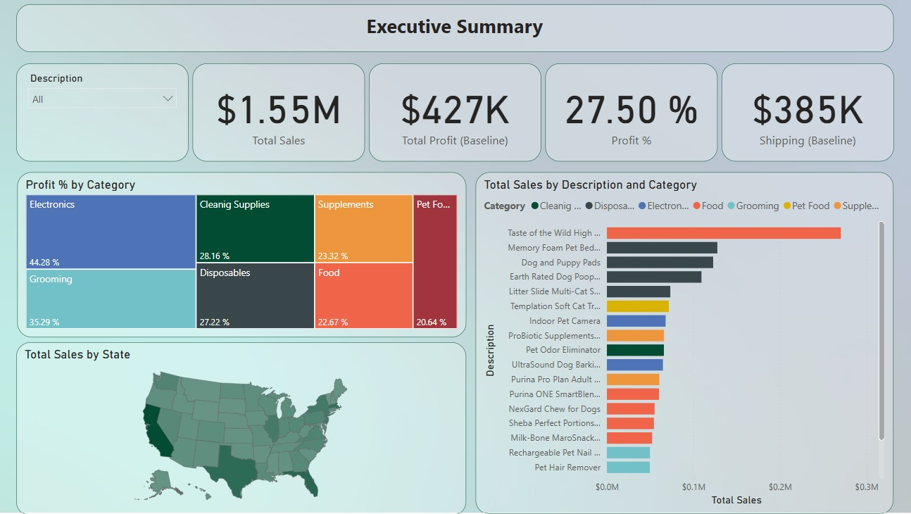
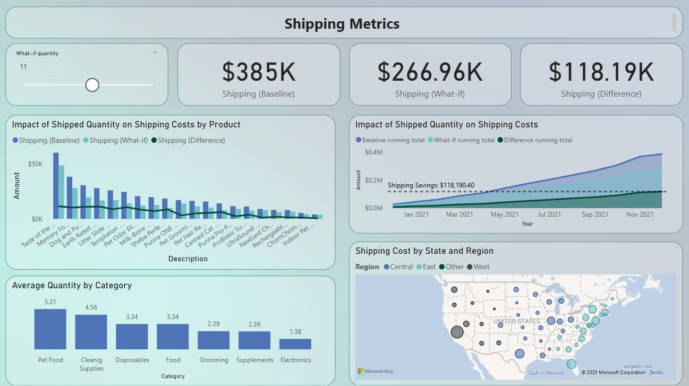
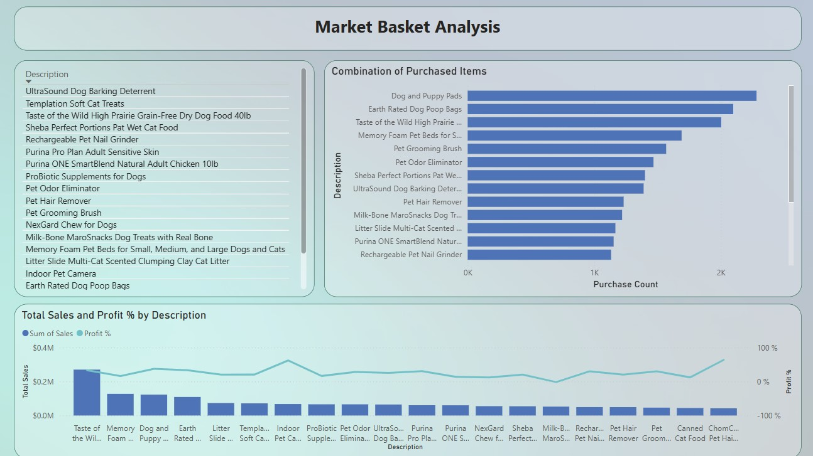

## Ecommerce Analysis with Power BI
In this Power BI case study, explore a real-world ecommerce business dataset to uncover insights for an online pet supply company called Whiskique. By leveraging Power BI tools and techniques, transforming raw data into actionable insights presented in engaging dashboard-style pages. This case study analyzes the ecommerce dataset and present findings through interactive and employ DAX to build insightful visualizationsand insights on key areas such as market basket analysis, what-if analysis for shipping cost optimization, and adherence to data visualization best practices.

## Business Goals:
The online supply company has several key goals:
1. **Uncover insights**: The company aims to gain a deeper understanding of its overall performance and identify improvement opportunities.
2. **Increase their Sales and Customers**:
      - **Upsell Opportunities**: By promoting relevant products during the purchase process.
      - **Cross-Sell Opportunities**: Encouraging customers to consider higher-priced alternatives or larger quantities of products.
3. **Reduce Operating Expenses**:
    - **Shipping Cost Reductions**:
      - Consolidate multiple shipments into a single one.
      - Optimize package size dimensions and weight to minimize shipping costs.
   

## Dashboards:
1. **Executive Summary**:

    Goal: visualize important KPIs and visuals to be quickly understood by executives, like the profit margin, top selling products, profit by category.. etc.
      
    

2. **Shipping Metrics**

    Goal: present the impact of shipping higher product quantities on sales, its effect on the company's profitability. 
      
    

3. **Market Basket Analysis**:

    Goal: analyze which products should be recommended to customers for cross-selling, the user can highlight a product to view which other products are bought with the selected product.
      
    